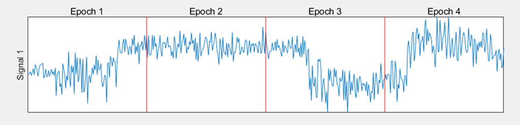
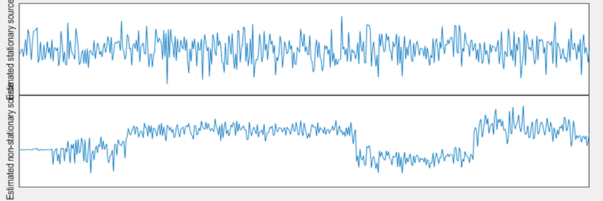
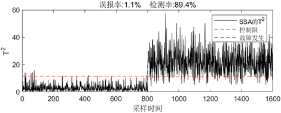
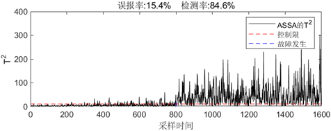
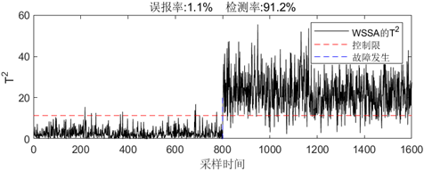
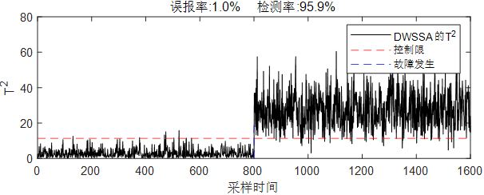

# Project Title

## Project Overview

This project aims to address the challenges posed by non-stationary characteristics in industrial processes for process monitoring. The statistical properties of non-stationary process data (e.g., mean, variance) change over time, making traditional monitoring methods prone to missed detections or false alarms. We propose a Dynamic Wasserstein Subspace Analysis (DWSSA) method, which, combined with time-delay embedding techniques, improves upon existing methods, achieving more accurate process monitoring.

## Background

Industrial processes often exhibit significant non-stationary characteristics due to factors such as feed fluctuations, setpoint changes, manufacturing strategy adjustments, and equipment aging. These variations make it difficult for traditional process monitoring methods to accurately capture anomalies, leading to missed detections or false alarms, which can result in safety hazards and reduced production efficiency. Existing non-stationary process monitoring methods, such as Stationary Subspace Analysis (SSA), are effective but have limitations as they do not account for the dynamic characteristics of the system.

## Main Work

To address the shortcomings of traditional methods, we propose a new Dynamic Wasserstein Stationary Subspace Analysis (DWSSA) method. This method replaces the traditional Kullback-Leibler divergence with the Wasserstein distance, addressing the limitations of non-convex optimization. It also employs time-delay embedding techniques to augment the process data matrix, taking into account the relationships between data at different sampling times. Numerical simulation experiments demonstrate the effectiveness of the DWSSA method, showing that it outperforms traditional methods in monitoring performance, significantly improving anomaly detection accuracy.

## Code Explanation

1. **Import the Training Dataset**: Load the necessary training dataset for model training and testing.
2. **Data Augmentation**: Use the "time-delay embedding" method to augment the process matrix to capture the temporal correlations within the data.
3. **Data Preprocessing**: Standardize or preprocess the augmented data to enhance model stability and performance.
4. **Solve the Orthogonal Matrix**: Solve for the orthogonal matrix required by the model using optimization algorithms.
5. **Compute the Subspace and Projection**: Calculate the true subspace and project the data to achieve process monitoring.

## Algorithm Performance

In this project, we compare the traditional SSA method, the improved WSSA method, and our proposed DWSSA method. The results demonstrate that the DWSSA method significantly reduces false alarm rates and improves detection rates, effectively addressing the limitations of traditional methods.

- **Input Signals**: Graphs illustrate the characteristics of the input signals.
- **Output Signals**: Graphs compare the output signals of various methods.
- **Monitoring Performance**: The DWSSA method significantly reduces false alarms while improving detection rates.
  
### Input Signals

### Output Signals

### Monitoring Performance Comparison

#### SSA

#### ASSA

#### WSSA

#### DWSSA

## License

This project is licensed under the [MIT License](LICENSE).
